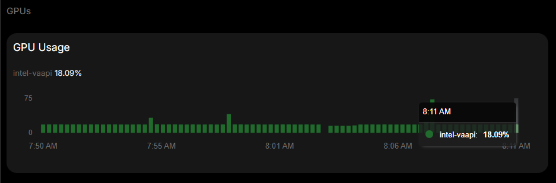

# Frigate Intel GPU Stats Fix (Alder Lake-N / Gen 12)

A drop-in replacement for `intel_gpu_top` that provides **accurate GPU usage stats** in [Frigate NVR](https://frigate.video/) on Intel Alder Lake-N (N100/N200/N305) and other Gen 12+ processors.

## The Problem

Frigate uses `intel_gpu_top` to display GPU utilization in the web UI. On Intel Alder Lake-N (Gen 12.2) and newer GPUs, `intel_gpu_top` v1.27 (bundled in Frigate and Debian 12) **reports 0%** for the Video and Render engines, even when VAAPI hardware transcoding is actively running.

This is a known limitation of `intel_gpu_top`'s performance counter reading on Gen 12+ architectures. The fixed-function media engines (hardware encode/decode) are not properly captured by the legacy perf counters.

**Before (broken):**
```
Frigate UI: Intel GPU: 0%
Frigate API: {"intel-vaapi": {"gpu": "", "mem": ""}}
```

**After (with this fix):**



```
Frigate API: {"intel-vaapi": {"gpu": "18.07%", "mem": "-%"}}
```

## How It Works

Instead of using broken perf counters, this script reads GPU engine usage directly from the **Linux DRM fdinfo interface** (`/proc/PID/fdinfo`), which provides accurate per-process GPU engine time in nanoseconds.

The script:
1. Finds all VAAPI ffmpeg processes inside the Frigate container
2. Reads cumulative GPU engine time from `/proc/PID/fdinfo/4` for each process
3. Compares with a cached snapshot from the previous invocation (every ~15s)
4. Calculates the delta to get real-time utilization percentages
5. Outputs JSON in the exact format Frigate expects from `intel_gpu_top`

Engines measured:
- **Render/3D** (`drm-engine-render`): Used by `scale_vaapi` for resolution downscaling
- **Video** (`drm-engine-video`): Used by `h264_vaapi` for H.264 hardware encoding

## Installation

### 1. Copy the script to your Frigate config directory

```bash
# Copy to your Frigate config directory
cp intel_gpu_top /path/to/frigate/config/intel_gpu_top
chmod +x /path/to/frigate/config/intel_gpu_top
```

### 2. Add a volume mount in `docker-compose.yml`

```yaml
services:
  frigate:
    volumes:
      # ... your existing volumes ...
      # Fix GPU stats for Alder Lake-N (replaces broken intel_gpu_top)
      - /path/to/frigate/config/intel_gpu_top:/usr/bin/intel_gpu_top:ro
```

### 3. Recreate the container

```bash
docker compose up -d
```

The first stats reading after restart will show 0% (cache is empty). After ~15 seconds, accurate stats will appear.

## Bonus: Detailed GPU Usage Script

The `gpu_usage.sh` script provides a detailed per-camera breakdown of GPU usage. Copy it to your server and run it:

```bash
chmod +x gpu_usage.sh
./gpu_usage.sh 5   # 5-second sampling interval
```

Example output:
```
Camera            Render%   Video%   Total%
---------------- -------- -------- --------
dahua_front          3.4%     6.2%     9.6%
tapo_backyard        3.3%     5.2%     8.4%
mancave              3.8%     4.2%     7.9%
livingroom           3.4%     4.3%     7.6%
doorbell             3.2%     3.4%     6.6%
---------------- -------- -------- --------
TOTAL               16.9%    23.5%    40.4%

GPU memory (per process): 40 MB

Render = scale_vaapi (downscale), Video = h264_vaapi (encode)
Sampled over 5s interval
```

> **Note:** Frigate displays `(Render + Video) / 2` as the GPU percentage (~18%), while the actual total GPU utilization across both engines is ~40%. Use `gpu_usage.sh` for the full picture.

## Compatibility

- **Tested on:** Intel N100 (Alder Lake-N, Gen 12.2)
- **Frigate:** 0.16.x, 0.17.x (any version that uses `intel_gpu_top`)
- **Should work on:** Any Intel Gen 12+ GPU where `intel_gpu_top` reports 0%
  - Alder Lake (12th Gen)
  - Raptor Lake (13th/14th Gen)
  - Meteor Lake, Lunar Lake, etc.
- **Container requirement:** Must run as privileged (or have access to `/proc/PID/fdinfo`)

## How Frigate Polls GPU Stats

Frigate internally runs:
```bash
timeout 0.5s intel_gpu_top -J -o - -s 1000
```

Every **15 seconds** (`FREQUENCY_STATS_POINTS`), expecting:
- JSON output with `engines.Render/3D/0.busy` and `engines.Video/0.busy`
- Exit code **124** (killed by timeout)

Our script completes in <100ms (no sleep needed thanks to the cache approach), well within the 0.5s timeout.

## Technical Details

The Linux kernel exposes per-process GPU engine usage via DRM fdinfo:

```
$ cat /proc/<ffmpeg_pid>/fdinfo/4
drm-driver:     i915
drm-engine-render:    62418463951 ns
drm-engine-video:     52567609040 ns
drm-engine-video-enhance: 0 ns
```

These are cumulative nanosecond counters. By taking two snapshots and dividing the delta by elapsed wall-clock time, we get accurate utilization percentages regardless of GPU generation.

## License

MIT
